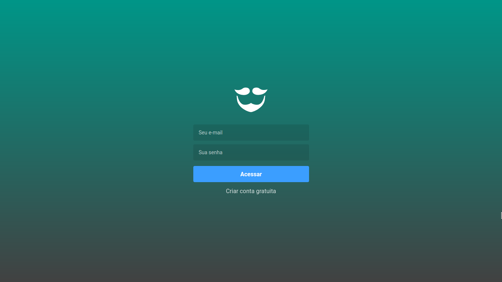

# beauty Salon Application
Aplicação para salões de beleza com aplicação web e mobile com react-native.

## A aplicação web 
O front-end foi construido com o reactjs que hoje é muito usado para construir spa.
E um framework muito facil de usar e muito pratico e produtivo

    

  

    

## Aplicação mobile 
 O cliente mobile foi construido com react-native usando as melhores praticas.

    

